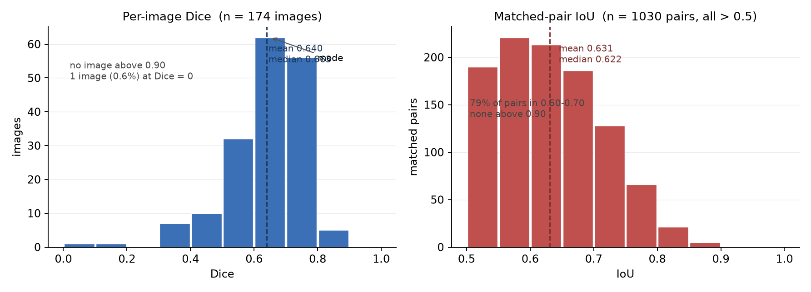

# Solar Filament Instance Segmentation — YOLO11-seg baseline

A reproducible baseline for the Kaggle / IEEE BigData Cup 2026 competition
**[Solar Filament Segmentation Challenge 2026](https://www.kaggle.com/competitions/filament-segmentation-2026)**:
segmenting solar filaments (thin, dark, elongated structures) in 2048×2048 Hα GONG
observations, and predicting each filament as a COCO RLE mask.

The point of this repo is not a leaderboard run for its own sake — it is a controlled study of
**which knob actually moves the metrics**, plus an honest account of one inference that turned
out to be wrong (see *Findings*, item 5).

## Competition submission package

| Item | Where |
|---|---|
| 4-page technical report (single PDF) | built from `report/competition/` in the organisers' Overleaf template |
| Public code repository | this repository |
| `requirements.txt` listing every package with its version | `requirements.txt` |
| Jupyter notebook showing the entire pipeline | `p4_pipeline.ipynb` (one `Run All` on Kaggle) |
| Test predictions | `submission.csv`, written by the notebook's prediction cell |

The report uses the organisers' ACM `acmart` (sigconf) template. `report/competition/main.tex` is
the submitted source; it expects the template's own `preamble.tex`, which is not redistributed here.

## Results

All local numbers are on a **date-grouped validation split** (whole months held out, `VAL_EVERY=4`):
282 COCO image entries → **174 distinct frames**, 2094 annotated filaments.
`yolo11n-seg`, `imgsz=1024`, `batch=4`, `seed=0`, single T4.

| Configuration | Training | mask mAP50 | mean Dice | image-PQ | global-PQ | tp / fp / fn |
|---|---|---|---|---|---|---|
| 640 px, 15 ep, conf 0.25 | 9.9 min | 0.538 | 0.5875 | 0.2045 | 0.2052 | 555 / 653 / 1539 |
| **1024 px**, 15 ep, conf 0.25 | 13.4 min | **0.622** | **0.6370** | **0.2946** | **0.2884** | 765 / 528 / 1329 |
| 1024 px, 30 ep, conf 0.10 | 32.8 min | **0.638** | 0.6396 | 0.2869 | 0.2816 | 1030 / 1490 / 1064 |
| 1024 px, 30 ep, **conf 0.25** | — | 0.638 | 0.6397 | 0.2884 | 0.2845 | 767 / 575 / 1327 |

Two public submissions, identical except for the confidence threshold:

| Submission | `CONF` | CSV rows | images with no prediction | Public LB |
|---|---|---|---|---|
| v1 | 0.10 | 2205 | 2 / 180 | 0.21 |
| **v2** | **0.25** | **1286** | 2 / 180 | **0.25** |

## Findings

1. **Input resolution is the only knob that clearly works.** 640 → 1024 gives +0.083 PQ
   (+44 % relative) for 3.5 extra minutes of training. The gain is almost entirely recall
   (26.5 % → 36.5 %): filaments are thin, so downscaling destroys them before the network
   ever sees them.
2. **Doubling the training budget is a negative result.** 15 → 30 epochs raises every detection
   metric (mask mAP50 0.622 → 0.638, mask precision 0.61 → 0.66) while PQ stays flat: the extra
   training trades recall for precision, and PQ penalises a miss and a false positive equally.
3. **Cutting false positives is worth far more than it looks locally.** On validation, raising
   the threshold from 0.10 to 0.25 changes global PQ by only +0.0029 (inside our own ±0.01 noise
   band) while cutting false positives from 1490 to 575. On the leaderboard it moved the score
   **0.21 → 0.25 (+19 % relative)** — direct evidence that the competition metric is a composite
   that penalises fragmentation and over-merging, not plain mean Dice. Predicted instance count
   also goes from 2520 (≈2× the GT count) to 1342 (≈ the GT count).
4. **The same frame can carry up to three annotations.** 1154 COCO image entries map to only 707
   real files. We therefore export labels keyed on the unique COCO `image_id` and symlink the
   original image — Ultralytics' `convert_coco(..., use_segments=True)` keys on `file_name` and
   would silently let one annotator overwrite another.
5. **A documented failure of our own reasoning.** Looking at the validation GT we noticed
   `tp + fn = 2094` exactly equals the annotation count while the evaluation only covers 174
   images, and *inferred* that merging duplicate annotations depressed PQ — estimating the
   corrected value at ≈ 0.37. **A measurement refuted it.** Re-scoring the same predictions under
   four GT protocols gives global PQ 0.2622–0.2816; de-duplicating *lowers* PQ, because different
   annotators label **complementary subsets**, not the same filaments twice — the union is the
   most complete ground truth. All four protocols stay below the organisers' 0.35 bar. The binding
   constraint is false positives, not the evaluation protocol.

## GT protocol measurement

One prediction pass over the 174 validation frames (2520 instances), re-scored four ways:

| GT protocol | mean Dice | image-PQ | global-PQ | tp | fp | fn | GT instances |
|---|---|---|---|---|---|---|---|
| **P0 union of all copies** | 0.6396 | 0.2869 | **0.2816** | 1030 | 1490 | 1064 | 2094 |
| P1 first annotator only | 0.6053 | 0.2710 | 0.2622 | 809 | 1711 | 532 | 1341 |
| P2 last annotator only | 0.6161 | 0.2854 | 0.2735 | 842 | 1678 | 475 | 1317 |
| P3 random annotator (×5) | 0.6090 | — | 0.2663 ± 0.0021 | — | — | — | — |

## Instance-level distributions

The rubric scores three distributions besides mean Dice and PQ. Measured on the same 174
validation frames (1030 matched pairs):

**Per-image Dice** — mean 0.6396, median 0.6628, p10 0.4905, p90 0.7586, mode in 0.60–0.70
(62 images). Only **1 image (0.6 %) fails completely**, but **not a single image exceeds 0.90**,
and just 5 sit in 0.80–0.90. 86 % of images land in 0.50–0.80: the model is *consistently
mediocre-to-good* — it never collapses and never nails a frame.

**Matched-pair IoU** (all > 0.5) — mean 0.6307, median 0.6217, mode in 0.55–0.60. 79 % of pairs
fall in 0.50–0.70; only 26 pairs (2.5 %) exceed 0.80 and **none exceed 0.90**. Matched masks are
barely over the line. Consequence: raising the PQ IoU threshold from 0.5 to 0.7 would discard
roughly 60 % of the current true positives. Mask tightness — not detection — is the next lever,
and it is invisible to Dice, which only compares mask unions.

**Prediction ↔ GT relations**

| claimed by *k* predictions | GT instances | | claims *k* GT instances | predictions |
|---|---|---|---|---|
| 0 (missed) | **743 (35.5 %)** | | 0 (pure false positive) | **1297 (51.5 %)** |
| 1 (clean) | 1062 | | 1 (clean) | 872 |
| 2 | 249 | | 2 | 243 |
| 3 | 33 | | 3 | 107 |
| 4 | 6 | | 4 | 1 |

Fragmentation (one prediction claiming >1 GT) accounts for 13.9 % of predictions; merging (one GT
claimed by >1 prediction) for 13.8 % of GT — almost equal, so no single failure mode dominates.

Taken together: **half the predictions match nothing, and the half that do match barely clear the
IoU bar.** That is the mechanism behind the leaderboard result in Findings item 3 — discarding 42 %
of the predictions by raising the confidence threshold *improved* the public score from 0.21 to
0.25, and the 1297 "claims 0 GT" predictions are exactly what got discarded.



## Repository layout

```
.
├── README.md
├── requirements.txt            # every package the notebook imports, with versions
├── LICENSE                     # MIT; competition data explicitly excluded
├── p4_pipeline.ipynb           # the full pipeline, top to bottom, Kaggle-ready
│                               #   (Cell 10 prints the environment for reproducibility)
├── figures/
│   ├── results.png             # training curves
│   ├── fig_qualitative.png     # qualitative successes and the two failure modes
│   ├── fig_distributions.png   # Dice / IoU distributions (rubric item)
│   ├── fig_pipeline.pdf        # pipeline diagram, vector
│   └── fig_qualitative.pdf     # qualitative figure, vector
└── report/
    ├── report.md               # the 4-page write-up, Markdown
    ├── report.tex              # same content in NeurIPS 2026 preprint format
    └── competition/            # the report as submitted (ACM acmart sigconf template)
        ├── main.tex
        ├── main.bib
        └── fig_*.pdf
```

## Reproducing

Everything runs on a **free Kaggle notebook** — no local GPU needed.

1. New notebook → **Add Input → Competitions → Solar Filament Segmentation Challenge 2026**.
2. Settings: **Accelerator = GPU T4 ×2**, **Internet = on**. The notebook has no persistence, so
   the packages are reinstalled at the top of Cell 1.
3. `Run All`. ~35 min for the 15-epoch configuration on a T4.
4. The last cells write `submission.csv` and print the local Dice / PQ summary.

Outside Kaggle: `pip install -r requirements.txt` and point `ROOT` in Cell 1 at the extracted
data directory. The pipeline writes ~2.6 GB of derived labels, so give it disk.

## Evaluation notes

- **Dice** is computed on the *union* of all masks in a frame, matching the leaderboard.
- **PQ** uses greedy one-to-one matching at IoU > 0.5, `PQ = Σ IoU / (|TP| + ½|FP| + ½|FN|)`.
- Matching runs through `pycocotools.mask.iou` on RLEs. Note the signature
  `iou(dt, gt, iscrowd)`: `iscrowd` must have **one entry per GT**, and you need the transpose to
  get the (GT × prediction) matrix. A naive Python double loop over 2048² boolean masks takes
  about an hour on 174 images; the RLE version takes seconds.
- The validation split is by **whole months** (`VAL_EVERY=4`, 29 of 118 months held out). Neighbouring
  solar frames are nearly identical, so a random split leaks badly.

## AI assistance disclosure

The pipeline was written by Yuxuan Li with an AI assistant (DeepSeek Harness). The assistant
contributed the data-structure investigation (1154 vs 707), the decision not to use
`convert_coco`, the month-grouped split, the `cache='ram'` / `workers=0` workaround for the
observed `Slow image access detected`, the RLE-based PQ evaluator, the GT-protocol measurement,
and the distributions cell. It also produced the incorrect ≈0.37 estimate described in
*Findings* item 5, which the measurement above retracts. All experimental choices and the final
submission decisions were made by the author.

## License

Code released under the MIT License. Competition data is **not** redistributed here; it remains
subject to the competition's own terms.
